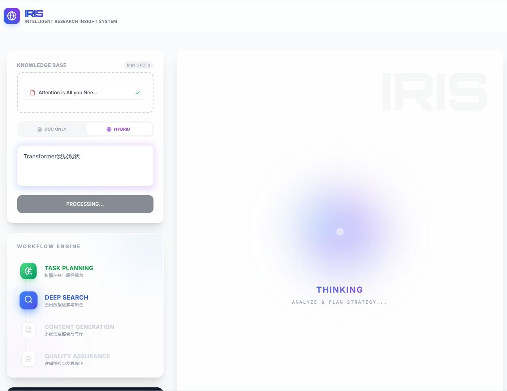
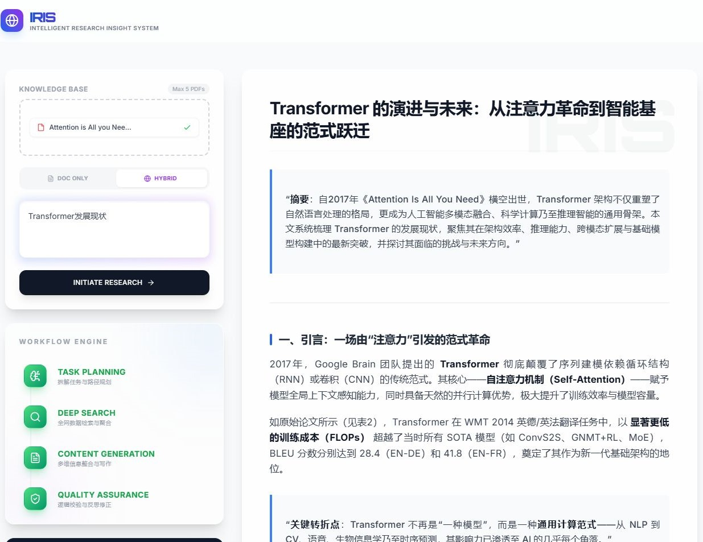

# 🌐 IRIS (Intelligent Research Insight System)

> **IRIS** 是一个基于 **Agentic Workflow（智能体工作流）** 的自动化深度调研与报告生成系统。它摒弃了传统单向 RAG（检索增强生成）的线性问答模式，通过构建多节点状态机（State Machine），实现了从**意图识别、路径规划、动态检索（混合/本地）、深度撰写到自我审查与局部微调**的全自动闭环。
### 演示截图 (Demo Screenshots)

#### 1. 系统主界面

*系统主界面展示，包含对话输入区、文件上传区和响应展示区*

#### 2. 报告生成效果

*系统生成的深度研究报告示例，包含格式化文本、数学公式和图表*

## ✨ 核心特性 (Key Features)

* 🧠 **Agentic 工作流引擎 (Powered by LangGraph)**
  * 采用图结构（Graph-based）替代传统的链式（LCEL）调用，支持复杂的条件分支与循环流转。
  * 内置 **Router（路由分配）**, **Planner（规划专家）**, **Researcher（检索专家）**, **Writer（主笔）**, **Reviewer（审查员）** 与 **Refiner（修订员）** 等异构节点协同工作。

* 🛡️ **防幻觉与动态路由 (Relevance Grader)**
  * 解决传统 RAG 的“强行回答/幻觉”痛点。在本地文档检索后，由轻量级裁判节点（Grader LLM）实时评估文档与问题的相关性。
  * 若发现用户上传的文档与问题无关，系统会自动触发**熔断机制**（在纯文档模式下终止并警告）或**智能降级**（在混合模式下自动切换至全网搜索）。

* 🔄 **会话级记忆与断点续跑 (Session-Level Persistence)**
  * 引入 `AsyncSqliteSaver` (SQLite Checkpoint 机制) 实现单次会话级持久化。
  * 配合前置**意图识别节点 (Intent Router)**，系统能精准区分“开启全新研究课题”与“针对现有报告下达修改指令”（如：“把第一章扩写得更通俗”），实现跨轮次的断点续写与局部微调。每次刷新页面即开启无痕新会话。

* ⚡ **全异步架构与流式传输 (Asynchronous & SSE)**
  * 后端基于 **FastAPI** 采用全异步 (`async/await`) 架构，无阻塞处理 LLM 节点调度与 SQLite 并发读写。
  * 采用 **Server-Sent Events (SSE)** 技术，将 Agent 的内部状态流转与最终报告的打字机效果（Typewriter）低延迟推送到前端。

* 🎨 **现代化交互体验 (Modern UI/UX)**
  * 前端采用 **Vue 3 + Tailwind CSS** 构建，包含仿 iOS Siri 风格的“呼吸灯”思考动效。
  * 深度整合 `markdown-it` 与 KaTeX，通过底层正则预处理攻克了跨大模型 LaTeX 定界符不一致的问题，完美渲染高难度数学公式。

---

## 🏗️ 系统架构图 (Architecture)

```text
User Input
    ↓
Intent Router
    ├── NEW_TOPIC → Task Planner
    └── REFINE    → Content Refiner → Final Output

Task Planner
    ↓
Deep Researcher
    ↓
Relevance Grader (Document Check)
    ├── Doc Only & Not Relevant
    │       → Stop & Warn User
    │
    ├── Hybrid Mode & Not Relevant
    │       → Web Search
    │       → Content Writer
    │
    └── Relevant
            → Content Writer
                    ↓
            Quality Reviewer
                    ├── FAIL → Back to Planner (Self-Correction Loop)
                    └── PASS → Final Output
```

---

## 🛠️ 技术栈 (Tech Stack)

### Backend (后端逻辑与智能体)
* **API 框架**: Python 3.10+, FastAPI
* **Agent 架构**: LangChain, LangGraph
* **向量检索**: ChromaDB (本地知识库 RAG)
* **持久化存储**: SQLite (`aiosqlite` 异步驱动支持 Checkpointing)
* **核心 LLM**: OpenAI API (GPT-4o, GPT-4o-mini)
* **网络搜索**: Tavily Search API

### Frontend (前端交互)
* **核心框架**: Vue 3 (Composition API)
* **UI 样式**: Tailwind CSS, @tailwindcss/typography
* **内容渲染**: `markdown-it`, `markdown-it-katex`

---

## 🚀 快速开始 (Getting Started)

### 1. 克隆项目
```bash
git clone https://github.com/ttguy0707/IRIS.git
cd IRIS
```

### 2. 后端服务配置 (Backend Setup)
```bash
cd backend

# 1. 创建并激活虚拟环境 (强烈推荐)
python -m venv venv
# Windows: venv\Scripts\activate
# Mac/Linux: source venv/bin/activate

# 2. 安装核心依赖
pip install -r requirements.txt

# 3. 配置环境变量
# 请在 backend 目录下新建 .env 文件并填入你的 API Keys:
# OPENAI_API_KEY=sk-...
# TAVILY_API_KEY=tvly-...

# 4. 启动 FastAPI 服务
uvicorn app.main:app --reload --host 0.0.0.0 --port 8000
```
*(服务启动后，Swagger API 调试文档可通过 `http://localhost:8000/docs` 访问)*

### 3. 前端服务配置 (Frontend Setup)
```bash
cd ../frontend

# 1. 安装 Node.js 依赖
npm install

# 2. 启动 Vite 开发服务器
npm run dev
```
*(打开浏览器访问终端中提示的 `http://localhost:5173` 即可开始使用)*

---

## 📂 核心目录结构 (Project Structure)

```text
IRIS/
├── backend/
│   ├── app/
│   │   ├── api/          # FastAPI 路由与中间件 (SSE 流式分发, 绝对路径挂载 SQLite)
│   │   ├── graph/        # LangGraph 核心逻辑
│   │   │   ├── nodes/    # 智能体节点 (Planner, Researcher, Writer, Router, Refiner, Reviewer)
│   │   │   ├── state.py  # 状态机字典定义 (AgentState)
│   │   │   └── graph.py  # 状态机拓扑构建与条件边连线
│   │   ├── rag/          # 文档解析、向量化与检索引擎 (ChromaDB)
│   │   └── tools/        # 外部扩展工具 (Tavily)
│   ├── main.py           # 后端入口文件
│   └── requirements.txt  # Python 依赖清单
├── frontend/
│   ├── src/
│   │   ├── components/   # Vue 组件 (状态流转组件、弹窗等)
│   │   ├── services/     # API 请求封装与 UUID 会话管理
│   │   └── App.vue       # 主页面逻辑与 UI 布局
│   ├── tailwind.config.js
│   └── package.json
└── README.md
```

---

## 💡 研发心得 (Developer Notes)

在构建 IRIS 的过程中，最大的挑战来自于**如何打破传统大模型黑盒调用的不可控性**。

通过引入 **LangGraph 状态机**，系统获得了在执行过程中“反思”与“动态纠错”的能力；而引入 `AsyncSqliteSaver` 则完美解决了无状态 API 的痛点。这不仅让智能体能够理解上下文并接受用户的“打回修改”指令，更大幅提升了复杂学术调研场景下的鲁棒性。该项目是对 Agentic System 底层运行机制、并发控制与前后端流式交互的一次深度工程实践。
